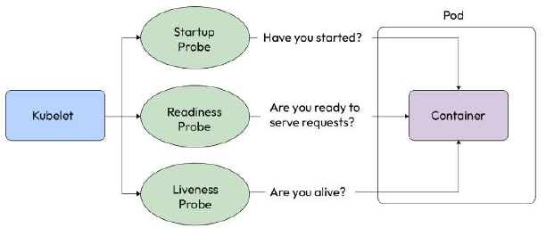

# Ensuring pod reliability
**We talked about health checks , Creating and Managing Container Images, and I also mentioned that you should not use them on the Docker level and instead use the ones provided by your container orchestrator. Kubernetes provides three probes to monitor your pod’s health – the `startup probe`, `liveness probe`, and `readiness probe`.**

**The following diagram depicts all three probes graphically:**


# Startup probe
**Kubernetes uses `startup probes` to check whether the application has started. `You can use startup probes on applications that start slow or those you don’t know how long it might take to start`. While the startup probe is active, it disables other probes so that they don’t interfere with its operation. As the application has not started until the startup probe reports it, there is no point in having any other probes active.**

# Readiness probe
**`Readiness probes` ascertain whether a container is ready to serve requests. `They differ from startup probes because, unlike the startup probe, which only checks whether the application has started, the readiness probe ensures that the container can begin to process requests`. A pod is ready when all the containers of the pod are ready. Readiness probes ensure that no traffic is sent to a pod if the pod is not ready. Therefore, it allows for a better user experience.**

# Liveness probe
**`Liveness probes` are used to check whether a container is running and healthy. `The probe checks the health of the containers periodically. If a container is found to be unhealthy, the liveness probe will kill the container. If you’ve set the restartPolicy field of your pod to Always or OnFailure, Kubernetes will restart the container`. Therefore, it improves the service’s reliability by detecting deadlocks and ensuring the containers are running instead of just reporting as running.**

# Probes in action
**Let’s improve the last manifest and add some probes to create the following `nginx-probe.yaml` manifest file:**

```yaml
 ...
    startupProbe:
      exec:
        command:
        - cat
        - /usr/share/nginx/html/index.html
      failureThreshold: 30
      periodSeconds: 10
    readinessProbe:
      httpGet:
        path: /
        port: 80
      initialDelaySeconds: 5
      periodSeconds: 5
    livenessProbe:
      httpGet:
        path: /
        port: 80
      initialDelaySeconds: 5
      periodSeconds: 3
  restartPolicy: Always
```

**The manifest file contains all three probes:**

**• The `startup probe` checks whether the `/usr/share/nginx/html/index.html` file exists.It will continue checking it 30 times at an interval of 10 seconds until one of them succeeds.Once it detects the file, the startup probe will stop probing further.**

**• The `readiness probe` checks whether there is a listener on `port 80` and responds with HTTP 2xx – 3xx on `path /`. It waits for 5 seconds initially and then checks the pod every 5 seconds. If it gets a 2xx – 3xx response, it will report the container as ready and accept requests.**

**• The `liveness probe` checks whether the pod responds with HTTP 2xx – 3xx on `port 80` and `path /`. It waits for 5 seconds initially and probes the container every 3 seconds. Suppose, during a check, that it finds the pod not responding for `failureThreshold` times (this defaults to 3). In that case, it will kill the container, and the kubelet will take appropriate action based on the pod’s `restartPolicy` field.**

**Let’s apply the YAML file and watch the pods come to life by using the following command:**
```shell
    $ kubectl delete pod nginx && kubectl apply -f nginx-probe.yaml && \
    kubectl get pod -w
    NAME    READY   STATUS              RESTARTS   AGE
    nginx   0/1     Running             0          4s
    nginx   0/1     Running             0          11s
    nginx   1/1     Running             0          12s
```

**As we can see, `the pod is quickly ready from the running state`. It takes approximately 10 seconds for that to happen as the readiness probe kicks in 10 seconds after the pod starts. Then, `the liveness probe keeps monitoring the health of the pod`.**

**Now, let’s do something that will break the liveness check. Imagine someone getting a shell to the container and deleting some important files. `How do you think the liveness probe will react?` Let’s have a look.**

**Let’s delete the /usr/share/nginx/html/index.html file from the container and then check how the container behaves using the following command:**
```shell
    $ kubectl exec -it nginx -- rm -rf /usr/share/nginx/html/index.html && \
    kubectl get pod nginx -w
    NAME    READY   STATUS    RESTARTS     AGE
    nginx   1/1     Running   0            2m5s
    nginx   0/1     Running   1 (2s ago)   2m17s
    nginx   1/1     Running   1 (8s ago)   2m22s
```