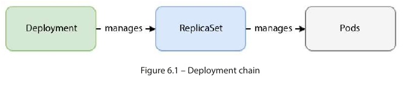

#   Deployment resources

**`Kubernetes Deployment resources help to manage deployments for container applications. They are typically used for managing stateless workload`s.**

**You can still use them to manage stateful applications, but the recommended approach for stateful applications is to use `StatefulSet` resources.**

**Kubernetes Deployments use `ReplicaSet` resources as a backend**, and the chain of resources looks like what’s shown in the following diagram:



**Let’s take the preceding example and create an nginx Deployment resource `manifest—nginx-deployment.yaml`:**
```yaml
apiVersion: apps/v1
kind: Deployment
metadata:
  name: nginx
  labels:
    app: nginx
spec:
  replicas: 3
  selector:
    matchLabels:
      app: nginx
  template:
    metadata:
      labels:
        app: nginx
    spec:
      containers:
      - name: nginx
        image: nginx
```

**The manifest is very similar to the `ReplicaSet` resource, except for the `kind` attribute — `Deployment`, in this case.**